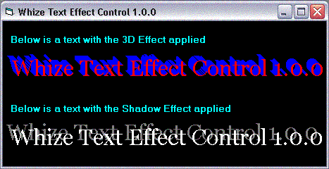

## Whize Text Effect Control 1\.0\.0

### Description

My program is a simple ActiveX control which lets u apply a shadow or a 3D effect to the text. It has one important property 'Distance', which lets u specify the distance the shadow is cast from the actual text. Really kool to add a fancy label to ur project. The next update will allow the user to change the angle of the shadow. So watch out for the next update. By the way, if u like this project, plz be kind enough to vote for it. ThanQ
 
### More Info
 

             |
---                |---
**Submitted On**   |2002-11-18 22:56:22
**By**             |[Dark Force](https://github.com/Planet-Source-Code/PSCIndex/blob/master/ByAuthor/dark-force.md)
**Level**          |Intermediate
**User Rating**    |5.0 (15 globes from 3 users)
**Compatibility**  |VB 6\.0
**Category**       |[OLE/ COM/ DCOM/ Active\-X](https://github.com/Planet-Source-Code/PSCIndex/blob/master/ByCategory/ole-com-dcom-active-x__1-29.md)
**World**          |[Visual Basic](https://github.com/Planet-Source-Code/PSCIndex/blob/master/ByWorld/visual-basic.md)
**Archive File**   |[Whize\_Text15001111192002\.zip](https://github.com/Planet-Source-Code/dark-force-whize-text-effect-control-1-0-0__1-40880/archive/master.zip)

